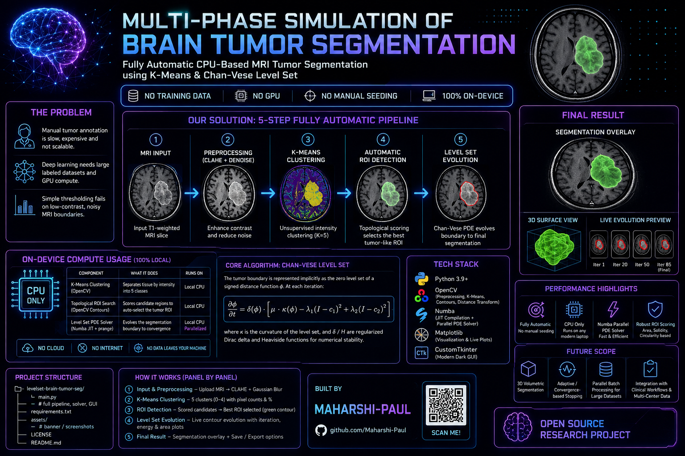

<p align="center">
  
</p>

# MULTI PHASE SIMULATION OF BRAIN TUMOR SEGMENTATION

**Fully automatic brain tumor segmentation from MRI — no manual seeding, no training data, no GPU. A K-Means + topological ROI search feeds a Numba-parallelized level set PDE solver, visualized live in a desktop dashboard.**

Built by [Maharshi-Paul](https://github.com/Maharshi-Paul)
Poster by [DIPESHCHOUDHARY-CODES](https://github.com/DIPESHCHOUDHARY-CODES)
---

## Table of Contents

- [Problem](#problem)
- [Solution](#solution)
- [On-Device Compute Usage](#on-device-compute-usage)
- [Core Algorithm](#core-algorithm)
- [Tech Stack](#tech-stack)
- [Project Structure](#project-structure)
- [Setup](#setup)
- [Usage](#usage)
- [How It Works, Panel by Panel](#how-it-works-panel-by-panel)
- [Optimizations](#optimizations)
- [Screenshots](#screenshots)
- [Known Limitations / Future Scope](#known-limitations--future-scope)
- [License](#license)

---

## Problem

Tumor segmentation in MRI is usually solved one of two ways: a radiologist manually annotates the boundary (slow, expensive, not scalable), or a deep learning model is trained on a large labeled dataset (needs GPU compute, labeled data, and often fails to generalize across scanners/protocols). Simpler intensity-based methods like thresholding break down on the low-contrast, noisy boundaries typical of tumor tissue — and most classical active-contour methods still require a human to manually place a seed point or bounding box before the algorithm can run.

## Solution

`levelset-brain-tumor-seg` removes the manual step entirely. It's a **fully automatic, PDE-based segmentation pipeline** that runs on CPU only:

1. **Unsupervised clustering** — K-Means (5 clusters) on a CLAHE-enhanced, denoised MRI slice separates tissue by intensity.
2. **Automatic ROI detection** — the three brightest clusters are scanned for candidate contours, each scored on area, solidity (convexity), and circularity, so the most tumor-like region is selected without any human input.
3. **Level set evolution (Chan-Vese)** — the selected ROI initializes a signed distance function, which is evolved via a regularized Heaviside/Dirac PDE combining a curvature term and a two-phase region-fitting term, converging to the tumor boundary.

All three stages are rendered live, side-by-side, as the simulation runs.

## On-Device Compute Usage

**Runs 100% locally, CPU-only — no cloud inference, no GPU required:**

| Component | What it does | Runs on |
|---|---|---|
| K-Means clustering (OpenCV) | Separates tissue by intensity into 5 classes | Local CPU |
| Topological ROI search (OpenCV contours) | Scores candidate regions to auto-select the tumor ROI | Local CPU |
| Level set PDE solver | Evolves the segmentation boundary to convergence | Local CPU, Numba JIT-compiled + parallelized (`prange`) |

No network calls, no external services, no data leaves the machine at any stage.

## Core Algorithm

The tumor boundary is represented implicitly as the zero level set of a signed distance function `φ`. At each iteration:

- Regional means `c1` (inside) and `c2` (outside) are computed as Heaviside-weighted averages of image intensity.
- `φ` is updated according to:

  ```
  ∂φ/∂t = δ(φ) · [ μ·κ(φ)  −  λ1·(I − c1)²  +  λ2·(I − c2)² ]
  ```

  where `κ` is the curvature of the level set (from finite-difference derivatives), and `δ` / `H` are regularized (smoothed) Dirac delta and Heaviside functions for numerical stability.

This is the classic **Chan-Vese "active contours without edges"** formulation — it segments by intensity homogeneity rather than by edge/gradient strength, which is well suited to MRI, where tumor boundaries are often low-contrast.

**Default parameters** (tunable in code):

| Parameter | Value | Description |
|---|---|---|
| `total_iterations` | 85 | Number of PDE evolution steps |
| `dt` | 0.5 | Time step |
| `λ1`, `λ2` | 1.0, 1.0 | Inside / outside region-fitting weights |
| `μ` | 0.5 or 0.25 | Curvature weight (adaptive on image variance) |
| `ε` | 1.0 | Heaviside / Dirac regularization width |

## Tech Stack

| Layer | Tool |
|---|---|
| PDE Solver | Custom Chan-Vese level set, JIT-compiled with `numba` (`@jit(nopython=True, parallel=True)`) |
| Preprocessing | OpenCV (`cv2`) — CLAHE, Gaussian blur, K-Means, contours, distance transform |
| GUI | CustomTkinter (dark theme) |
| Visualization | Matplotlib, embedded via `FigureCanvasTkAgg` |
| Language | Python 3.9+ |

## Project Structure

```
levelset-brain-tumor-seg/
├── main.py            # full app: preprocessing, K-Means, ROI search, PDE solver, GUI
├── requirements.txt
├── assets/             # banner / screenshots
├── LICENSE
└── README.md
```

> Currently a single-file application — `main.py` contains the full pipeline. A modular split (`solver.py`, `preprocessing.py`, `gui.py`) is a natural next step as the project grows.

## Setup

### 1. Clone the repo
```bash
git clone https://github.com/Maharshi-Paul/levelset-brain-tumor-seg.git
cd levelset-brain-tumor-seg
```

### 2. Create a virtual environment and install dependencies
```bash
python -m venv venv
venv\Scripts\activate       # Windows
# source venv/bin/activate  # macOS/Linux

pip install -r requirements.txt
```

`requirements.txt`:
```
numpy
opencv-python
customtkinter
matplotlib
numba
```

> First run will take a few extra seconds while Numba JIT-compiles the PDE solver.

## Usage

```bash
python main.py
```

1. Click **Upload Batch & Segment** and select one or more MRI images (`.png`, `.jpg`, `.jpeg`, `.tif`, `.bmp`).
2. The pipeline runs automatically: clustering → ROI detection → level set initialization → PDE evolution.
3. Watch the segmentation boundary evolve live in the third panel.
4. Once complete, use **Prev / Next** to step through the batch — each image is segmented independently.

## How It Works, Panel by Panel

| Panel | Shows |
|---|---|
| 1. Unsupervised Clusters | Raw K-Means output over pixel intensities |
| 2. Convex Hull ROI | The auto-selected tumor candidate (cyan fill) and its convex hull (green outline), with a live solidity score |
| 3. Level Set Evolution | The MRI slice with the evolving `φ = 0` contour (neon green) overlaid, refreshed every 10 iterations until convergence |

## Optimizations

- **Numba JIT + `prange` parallelization** — the PDE core (`compute_pde_step`) is compiled ahead-of-time and distributes both the regional-mean reduction and the curvature computation across CPU cores, instead of running as interpreted Python/NumPy loops.
- **Adaptive curvature weight** — `μ` is set lower for higher-variance (noisier) images and higher for smoother ones, instead of a single fixed value.
- **Bounded image size** — inputs are downscaled to a maximum dimension of 400px before solving, since PDE cost scales with pixel count and MRI slices are often larger than needed for stable convergence.
- **Async simulation thread** — the PDE solver runs on a background thread while the GUI polls for progress every 50ms, keeping the interface responsive during long-running evolutions.

## Screenshots

*Add screenshots of the running dashboard here (e.g. `assets/dashboard.png`) — showing the three-panel view mid-evolution is the most representative shot.*

## Known Limitations / Future Scope

- Operates on 2D slices; no full 3D volumetric segmentation yet.
- Automatic ROI selection assumes the tumor is among the brighter intensity clusters — atypical or very low-contrast lesions may need manual tuning of `search_clusters` or the scoring heuristic.
- Fixed iteration count (85) rather than convergence-based stopping; a `‖φ_new − φ_old‖` threshold would be a natural improvement.
- Single-image-at-a-time PDE solve; batch images are processed sequentially, not in parallel with each other.
- Research/educational tool — **not validated for clinical or diagnostic use**.

## License

MIT — see [LICENSE](./LICENSE)
